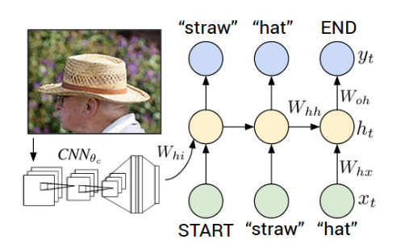
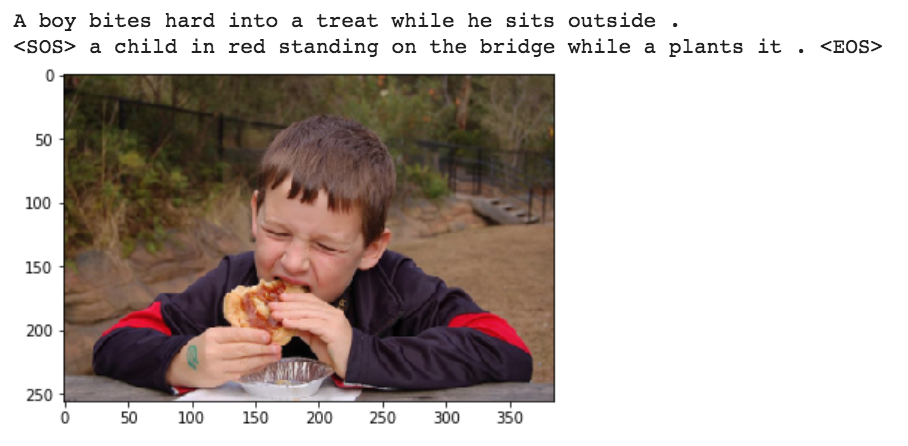

# image_caption_generator
Implementation of deep learning research paper "Show and Tell: A Neural Image Caption Generator"

## Overview
*NOTE: This is still in progress, and I am working on getting better results.*

This project is my first attempt at building a deep learning application from scratch, start to finish. This project was not a premade lab for a class, and I worked on this project independently. 

The foudation of my model is the paper "Show and Tell: A Neural Image Caption Generator" by Vinyals et al. (2015). I wanted the exercise of reading, understanding, and implementing a research paper. My plan is to get a basic model running as described in the paper, and then optimize the model with newer techniques.

The model receives an image as input and returns an appropriate caption for the image as output.

I used PyTorch and worked in Google Colab.

## Dataset
I used the Flickr8k dataset. This was the smallest of the datasets mentioned in the paper, so I figured it would be a good one to start with to get things running. 

The dataset has ~8000 images with a recommended 6000/2000 training/validation split. Each image has 5 corresponding captions.

## Model
The paper doesn't include specifics on the CNN architecture, so I decided to use a pretrained DenseNet as the CNN in my model. The image encoding that is output by the CNN is the first input passed into an RNN with an LSTM at its core. I created a corpus dictionary of all the words in all the captions, and then passed in a tensor of the corresponding word indices for the caption to the LSTM. Finally I used a linear layer to output a distribution for dictionary indices. 

For training, I used a method called teacher-forcer where rather than having the next word be predicted by the output of the previous LSTM block, you pass in the next correct word from the target caption as input to the LSTM. This method tends to produce better results in training.

Loss is computed by...

## Current Results
*NOTE: I am still actively updating this project and working on getting better results.*

My results haven't been incredible yet. I have managed to get the model running and producing output, but the loss is plateauing after a while.

Here is an example of output. The first line is the target caption. The second line is the output of my model:

  
It seems that the model may have been able to identify some important objects in the photo (the boy, his red clothes, the plants behind him), but the caption doesn't really match the image very well. It does at least look like the model somewhat understands the way a caption should be structured. The grammar is decent, but the actual content of the caption is pretty much nonsense.

## Moving Forward
Here are some ideas that I am currently working on to get the model to perform better:
 - The dataset comes with five captions for each image. I only calculated loss on a single target caption for each image, but that’s a pretty strict metric. I would rather get the loss for whichever caption it was closest to of the five.
 - I might want to experiment with sentence embeddings, to get a better representation of how “close” my output caption was to the target caption.
 - I could try adjusting the sizes of layers within both the CNN and the RNN.
 - The paper talks about using a beam search rather than a greedy algorithm to predict the next word. That is something I could try.
 - There is a good chance the LSTM isn’t the best option. I could try using a GRU, or try to implement Attention.
 - I could try tinkering with various things like learning rate, batch size, the optimizer I use, activation functions, etc.
